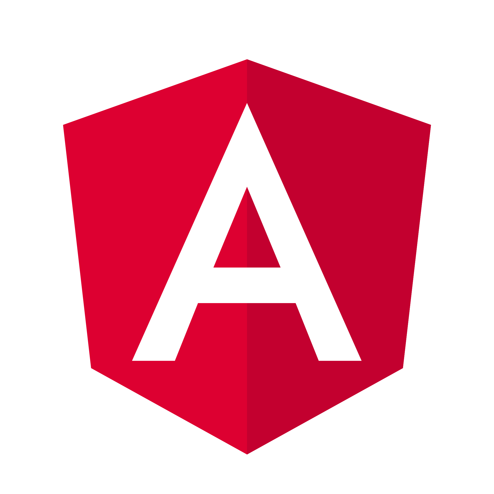
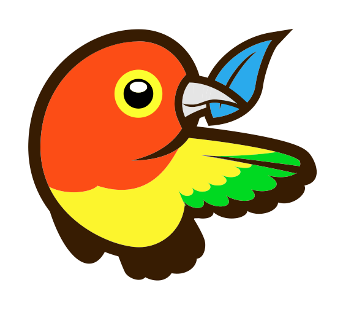
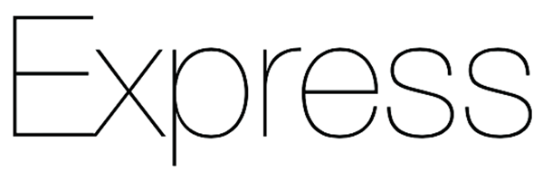
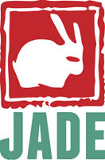
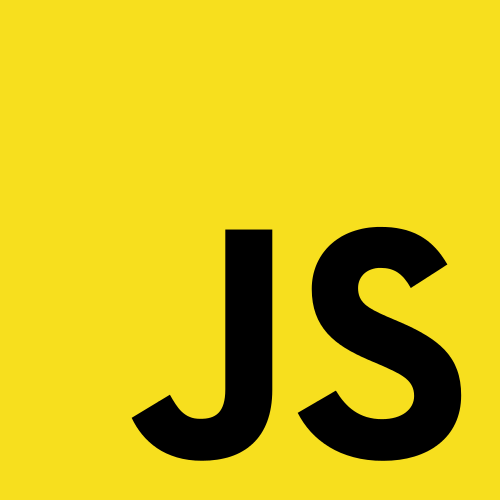
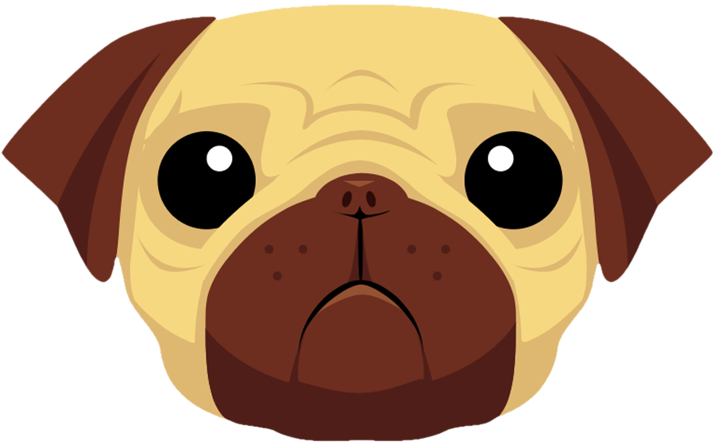
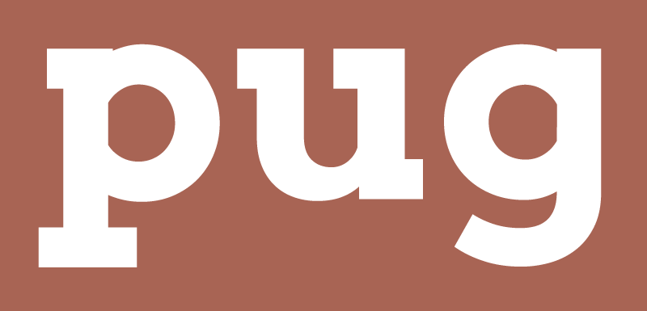

#Curated list of png/svg web-dev logos

### Currently:

1. [angular ](angular.png)
1. [babel ](babel.png)
1. [bourbon with text ](bourbon-logo-2.png)
1. [bourbon logo only ](bourbon-logo.png)
1. [bower ](bower.png)
1. [browserify ](browserify.png)
1. [browserify2 ](browserify2.png)
1. [css3 ](css3.png)
1. [ejs ](ejs.png)
1. [express ](express.png)
1. [firebase ](firebase.png)
1. [full mean stack ](fullMean.png)
1. [github ](github.png)
1. [grunt ](grunt.ong.png)
1. [gulp ](gulp.png)
1. [html5 ](html5.png)
1. [jade ](jade.png)
1. [jasmine svg ](jasmine.svg)
1. [javascript ](jslogo.png)
1. [jquery ](jquery.png)
1. [mocha ](mocha.png)
1. [mongo DB ](mongo.png)
1. [nodejs svg ](nodejs.svg)
1. [npm ](npm.png)
1. [postgres ](postgres.png)
1. [pugFace ](pugFace.png)
1. [pugSolid ](pugSolid.png)
1. [pugTextBW ](pugTextBW.png)
1. [pugTextColor ](pugTextColor.png)
1. [react ](react.png)
1. [redux ](redux.png)
1. [sass ](sass.png)
1. [tape ](tape.png)
1. [yeoman ](yeoman-logo.png)

### Feel free to add your own, just make a PR!  

PS - the SVG files don't work here (and most likely in your repo) due to an issue on Github:
https://github.com/isaacs/github/issues/316 but should work fine if you download them
for use on your site.

***
### Adding to the List
#### Formatting
Display:  
1. [angular](angular.png)  

Markup:  
**`1. [angular](angular.png)  `**

Format:  
**`1. [text to display](imageName.file)<imc src="imageName.file" height="desired height in pixels">`**  
* The "1." at the beginning of the line stays the same throughout the list (markup knows to increment for you)
* The two instances of (imageName.file) are doing different things:
  1. **`[angular](angular.png)`** - sets it as a link to the github source file page (then you'll want to right click and copy img location)
  2. **``** - sets up the image in the README and sets the size to a height of 40px
